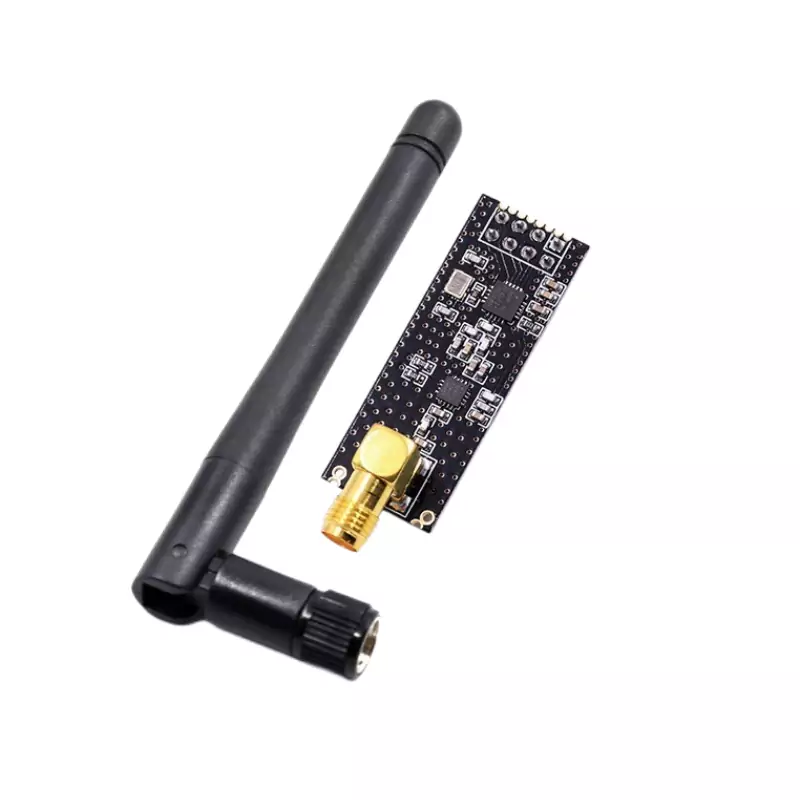
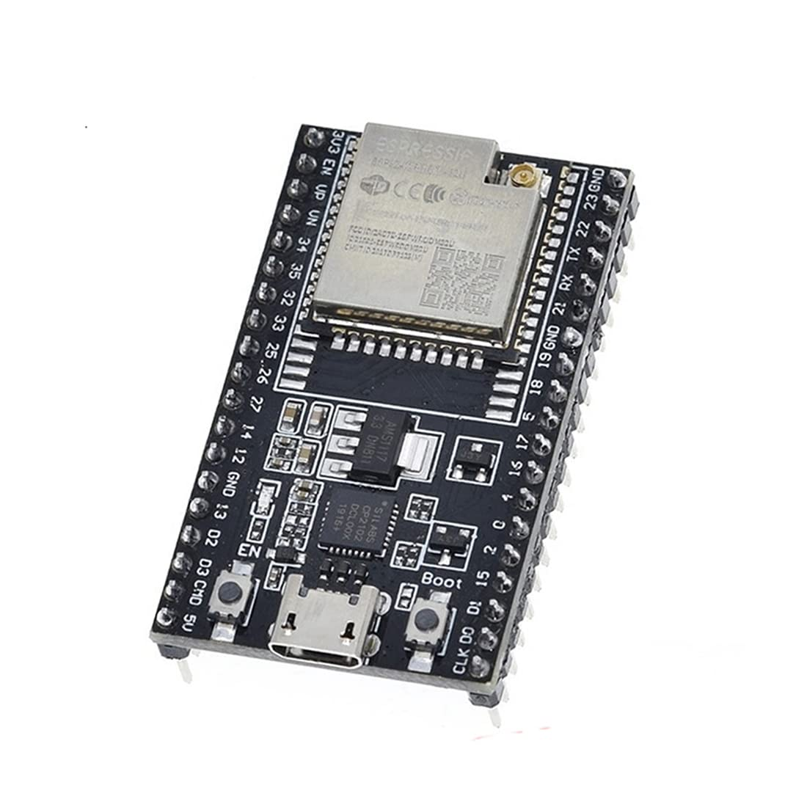

# Blue Noise

### Open-source Wireless Jamming Pentesting Device using ESP32-WROOM-32U & 2 NRFL01+PA+LNA Modules

### Part of the exhibtion : https://weltecho.eu/veranstaltung/vernissage-28/

 ---
# WHAT DOES IT DO?

**IT CREATES NOISE SIGNAL TO JAM BLUETOOTH AND WIFI USING NRF24L01 AND ESP32 IN RANGE 2.4GHZ DEVICES, EFFECTS MAY VARY DEPENDS ON DEVICE BLUETOOTH VERSIONS....WARNING!!! JAMMING IS ILLEGAL**

---

## REQUIRED DEVICE AND MODULE:
1. `NRF24L01+ PLUS – PA LNA SMA Antenne`
-  

2. `1pc ESP32U` 
- 

3. `25V 47UF CAPACITORF` 
- 

4. `1 DIP SWITCH` 
- 

5. `DC Voltage Regulator Step Down Converter 4.5 V-12 V to 3.3 V/5 V 800 mA Power Supply Regulator Adjustment (5 Volt)` 
- 

6. `9V Alkaline Batteries` 
- 

7. `9V Battery Holder` 
- 

---
